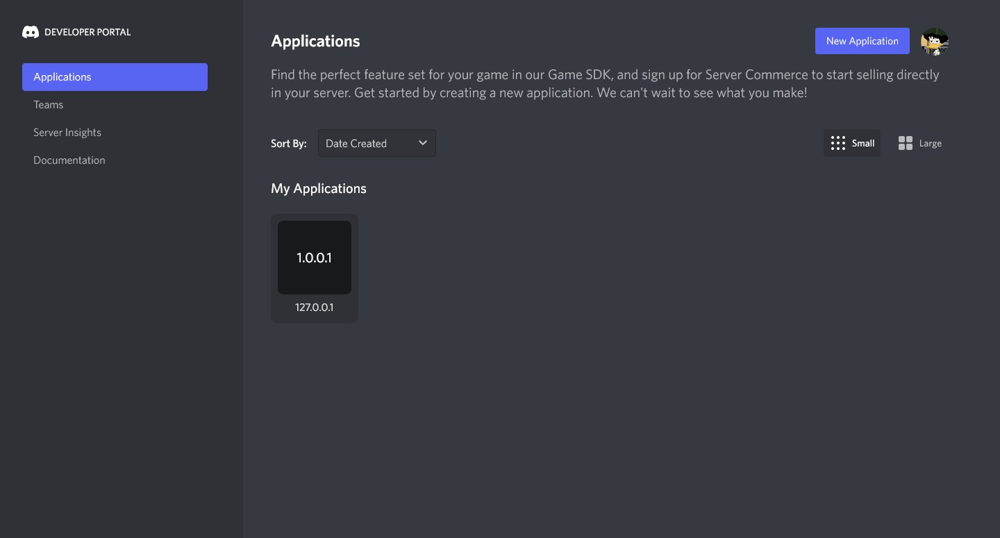
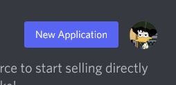
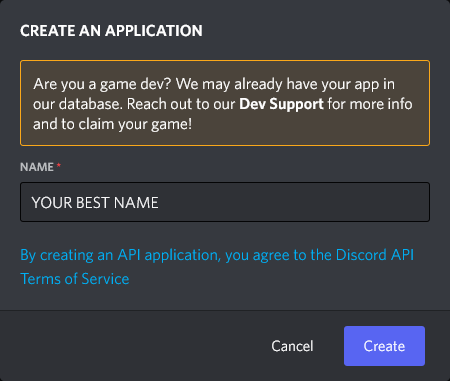
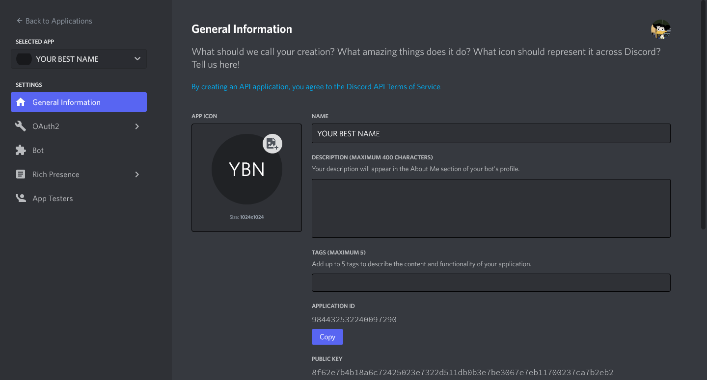
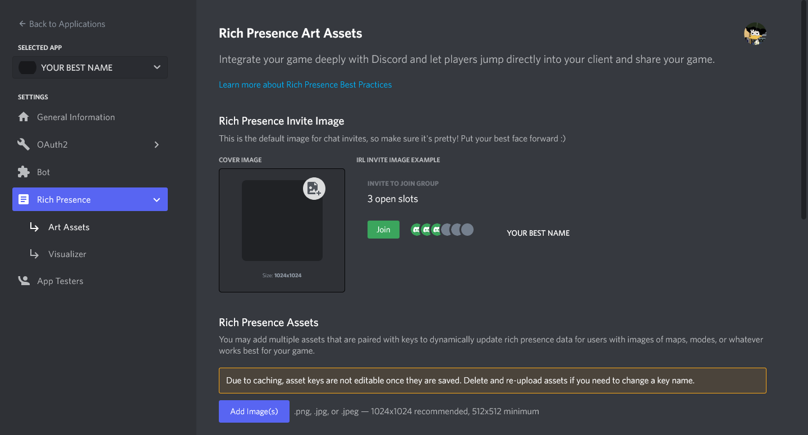
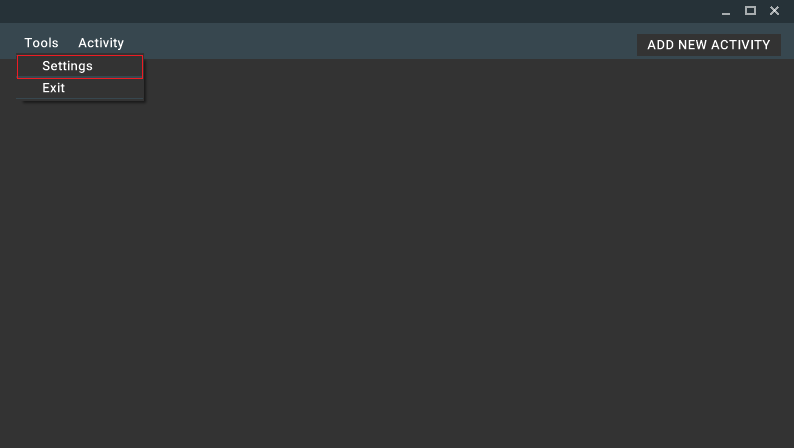
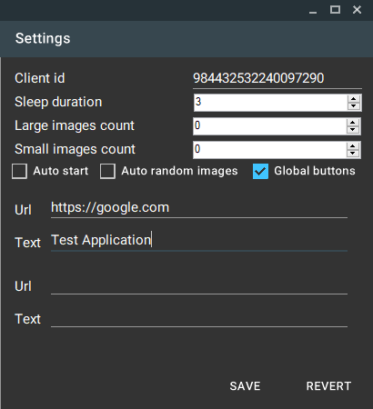
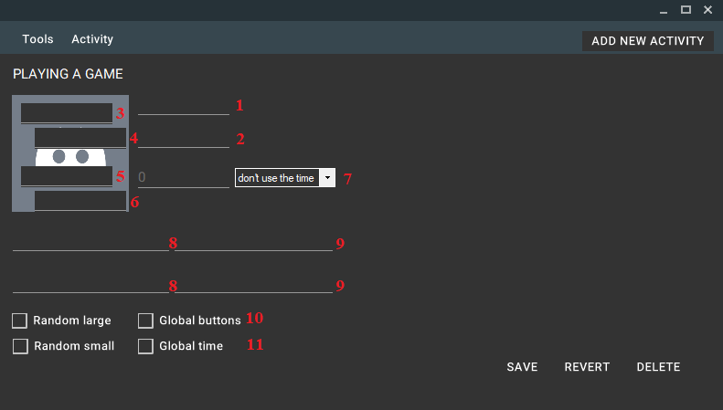
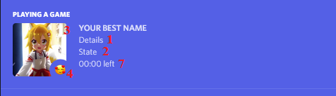

##  User's Guide

This guide will help you set up everything you need to run the application and make it work correctly.

### Discord Developer Portal

#### *Create Application*

1. Go to the [**Discord Developer Portal**](https://discord.com/developers/applications) website.
2. Make sure you are on the create and manage applications page.\

3. Сlick on the **New Application** button in the upper right corner next to your profile picture.\

4. Name your application with a *name* at your discretion, this *name* will be displayed in your gaming activity.\

5. Click on the **Create** button. This will take you to the settings page of this application.\

6. Find the **Application ID** on the page and copy it to any text document.\

#### *Add Images*

1. Go to the **Rich Presence** tab using the menu on the left side of the screen. Make sure you are in **Art Assets**.\

2. Use the **Add Image(s)** button at the bottom to add one or more images and remember/write down their names.

### Discord Animated Activity

#### *Install*

1. Go to the [**Discord Animated Activity**](https://github.com/gdeMojChay/DiscordAnimatedActivity/releases) Releases.
2. Expand **Assets** and download the archive **Release.zip**.
3. Unzip the archive to any place convenient for you.
4. Run **DiscordAnimatedActivity.exe** file.

#### *Settings*

1. Click on "**Tools**" and select "**Settings**" from the drop-down list.\

2. Enter the previously received **Application ID** in the **Client id** field.
3. Enter or scroll with the mouse in the field **Sleep duration** the desired time for the delay between the change of *game activities* in *seconds*.
4. If desired, you can activate **Global buttons** by clicking on the corresponding field (Button settings will be described below).\

5. Click on the **SAVE** button.
6. Close window.

 
##### ***Note***

The fields **Large/Small Images Count**, **Auto start** and **Auto random images** do not yet have working functionality.
  

#### *Add Activities*

1. Click on the **ADD NEW ACTIVITY** button.
2. Fields for customizing *game activity* will appear below.\

The image below shows how the fields in the application and the display in Discord relate.\

#### *Customization Of Activity*

1. **Details** - The top field to change. You can enter any line of reasonable size.
2. **State** - The lower field is changeable. You can enter any line of reasonable size.
3. **Large Image Key** - Large image. It is necessary to enter the exact name of the desired image from **Art Assets** here.
4. **Large Image PlaceHolder** - The text that is displayed when hovering over a large image. You can enter any line of reasonable size.
5. **Small Image Key** - Small image. It is necessary to enter the exact name of the desired image from **Art Assets** here.
6. **Small Image PlaceHolder** - The text that is displayed when hovering over a small image. You can enter any line of reasonable size.
7. **Time Settings** - There are 3 modes available: **don't use time**, **elapsed** and **left**. When switching the mode to **elapsed** or **left**, a field for entering time in *seconds* becomes available to the left (counted from the current time).
8. **Buttons Urls** - Fields for entering links to websites for buttons. the link should look like *http(s)://website.com/*.
9. **Buttons Texts** - Fields for entering text to be displayed on the buttons.  You can enter any line of reasonable size.

 
##### ***Note***

For the second button to work, the first one must be present.
  

10. **Global buttons** - When activated, the buttons are picked up from the **Settings** window.
11. **Global time** - When activated, the countdown (**left** only) continues continuously.

 
##### ***Note***

**Random large/small** buttons have no functionality.
  

12. Click on the **SAVE** button.

#### *Run*

1. Make sure you have **Discord** running.
2. Click on "**Activity**" and select "**Start**" from the drop-down list.

#### *Stop*

1. Click on "**Activity**" and select "**Stop**" from the drop-down list.
